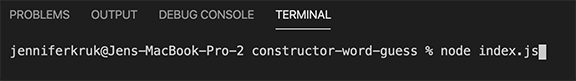
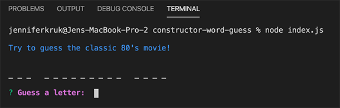
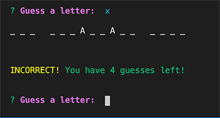
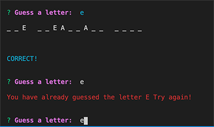
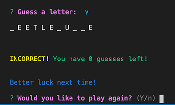
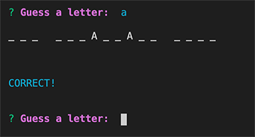

# constructor-word-guess

### A Word Guess Game using Javascript, Node.js, Inquirer and Chalk

## Instructions
* Enter letters to try to guess the classic '80's movie!
* You get 8 tries!

## Start the game

## Guess a letter

## Incorrect Guess

## Repeated Guess

# Game Lost

# Correct Guess

# Game Won

# Link to Demonstration Video
https://drive.google.com/file/d/1kWRZZlwwanlSxGPjbZEIwvodAeOIrrrq/view